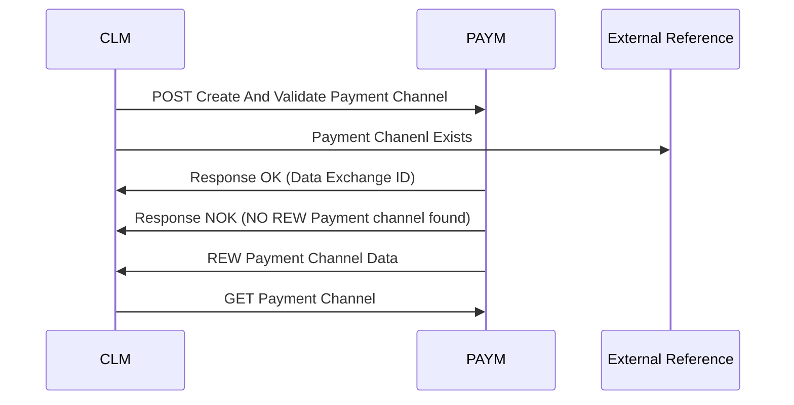

# Creation of CEL Rewards

```mermaid
sequenceDiagram
    participant CLM as CLM
    participant PAYM as PAYM
    participant External_Reference as External Reference
    CLM->>PAYM: POST Create And Validate Payment Channel
    CLM->>External_Reference: Payment Chanenl Exists
    PAYM->>CLM: Response OK (Data Exchange ID)
    PAYM->>CLM: Response NOK (NO REW Payment channel found)
    PAYM->>CLM: REW Payment Channel Data 
    CLM->>PAYM: GET Payment Channel
```
