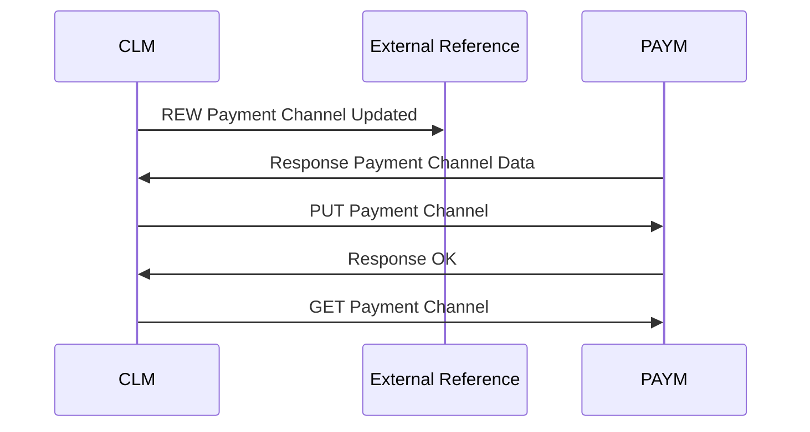

# Update CEL Rewards

```mermaid
sequenceDiagram
    participant CLM as CLM
    participant External_Reference as External Reference
    participant PAYM as PAYM
    CLM->>External_Reference: REW Payment Channel Updated
    PAYM->>CLM: Response Payment Channel Data
    CLM->>PAYM: PUT Payment Channel 
    PAYM->>CLM: Response OK
    CLM->>PAYM: GET Payment Channel
```
