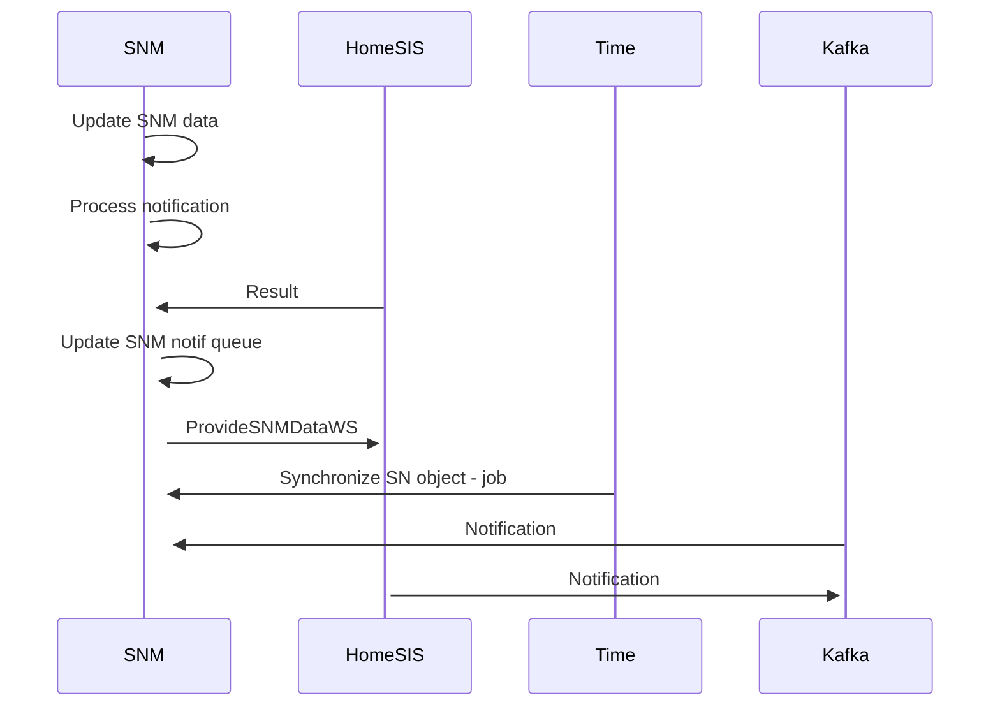

# Synchronization of SNM data

- **Diagram Type**: Sequence
- **Package**: HomerSelect/BSL/Analysis Model/Sales Network Management/Synchronization/Use case/Synchronization of SNM data
- **Diagram ID**: 161256
- **Elements**: 4
- **Connectors**: 8

