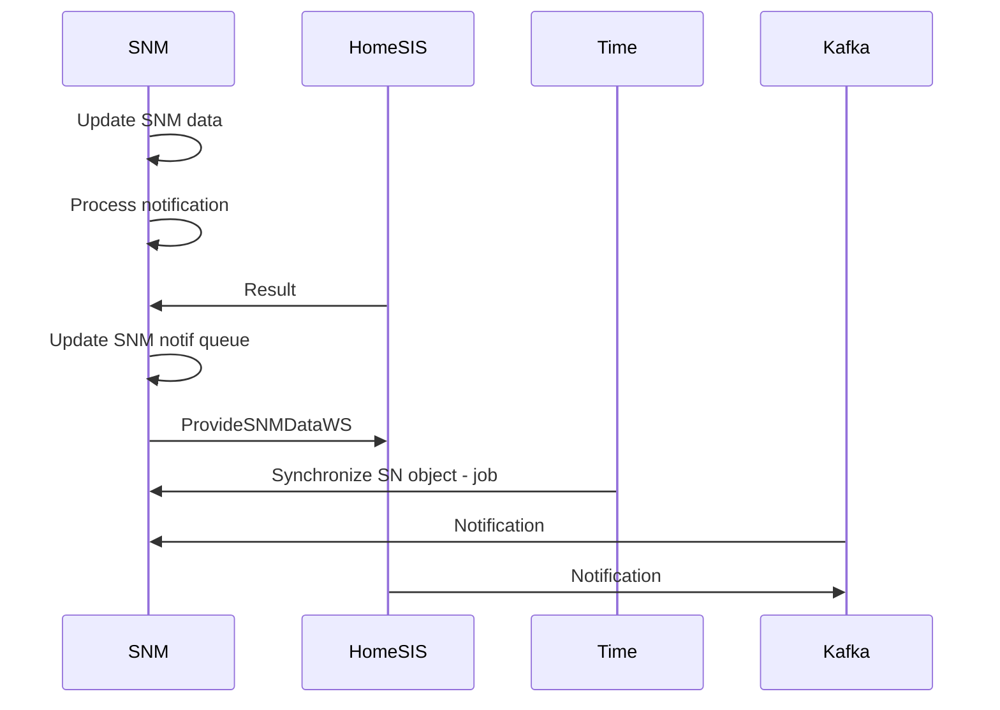

# Synchronization of SNM data

```mermaid
sequenceDiagram
    participant SNM as SNM
    participant HomeSIS as HomeSIS
    participant Time as Time
    participant Kafka as Kafka
    SNM->>SNM: Update SNM data
    SNM->>SNM: Process notification
    HomeSIS->>SNM: Result
    SNM->>SNM: Update SNM notif queue
    SNM->>HomeSIS: ProvideSNMDataWS
    Time->>SNM: Synchronize SN object - job
    Kafka->>SNM: Notification
    HomeSIS->>Kafka: Notification
```
