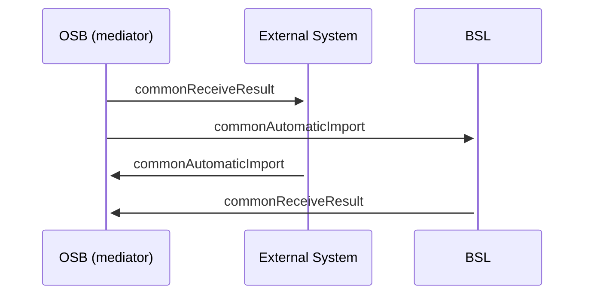

# Common Automatic Import SD

- **Diagram Type**: Sequence
- **Package**: HomerSelect/BSL/Analysis Model/_Interface/Provided Web Services/Communication/CommunicationListImportWS/Common Automatic Import SD
- **Diagram ID**: 100552
- **Elements**: 4
- **Connectors**: 4

