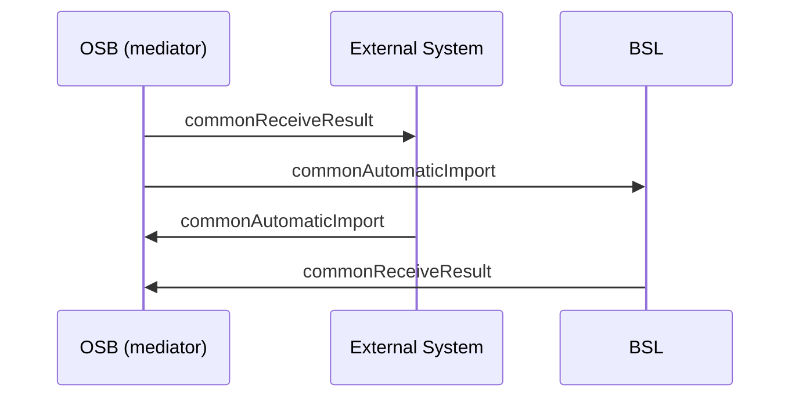

# Common Automatic Import SD

```mermaid
sequenceDiagram
    participant OSB_mediator as OSB (mediator)
    participant External_System as External System
    participant BSL as BSL
    OSB_mediator->>External_System: commonReceiveResult
    OSB_mediator->>BSL: commonAutomaticImport
    External_System->>OSB_mediator: commonAutomaticImport
    BSL->>OSB_mediator: commonReceiveResult
```
