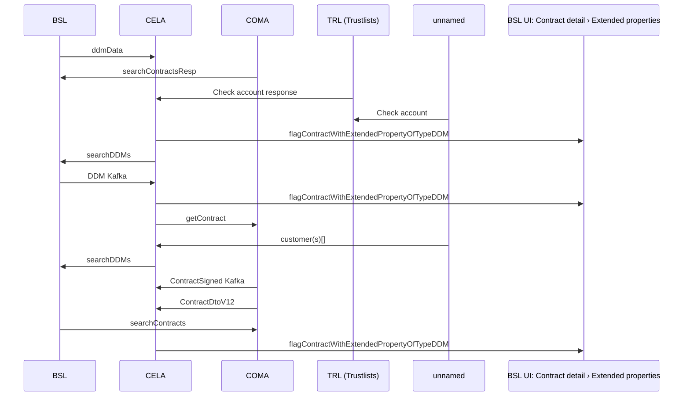

# DDM validation

```mermaid
sequenceDiagram
    participant BSL as BSL
    participant CELA as CELA
    participant COMA as COMA
    participant TRL_Trustlists as TRL (Trustlists)
    participant unnamed as unnamed
    participant BSL_UI_Contract_detail_Extended_properties as BSL UI: Contract detail › Extended properties
    participant unnamed as unnamed
    BSL->>CELA: ddmData
    COMA->>BSL: searchContractsResp
    TRL_Trustlists->>CELA: Check account response
    unnamed->>TRL_Trustlists: Check account
    CELA->>BSL_UI_Contract_detail_Extended_properties: flagContractWithExtendedPropertyOfTypeDDM
    CELA->>BSL: searchDDMs
    BSL->>CELA: DDM Kafka
    CELA->>BSL_UI_Contract_detail_Extended_properties: flagContractWithExtendedPropertyOfTypeDDM
    CELA->>COMA: getContract
    unnamed->>CELA: customer(s)[]
    CELA->>BSL: searchDDMs
    COMA->>CELA: ContractSigned Kafka
    COMA->>CELA: ContractDtoV12
    BSL->>COMA: searchContracts
    CELA->>BSL_UI_Contract_detail_Extended_properties: flagContractWithExtendedPropertyOfTypeDDM
```
