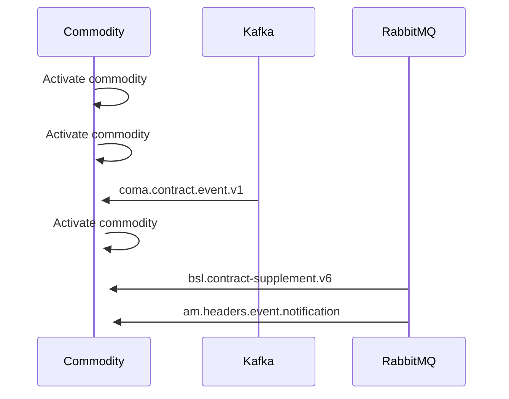

# Commodity activation

- **Diagram Type**: Sequence
- **Package**: HomerSelect/BSL/Modules/Commodity/Analytical Model/Commodity Data/Use Case/Commodity activation
- **Diagram ID**: 161136
- **Elements**: 3
- **Connectors**: 6

