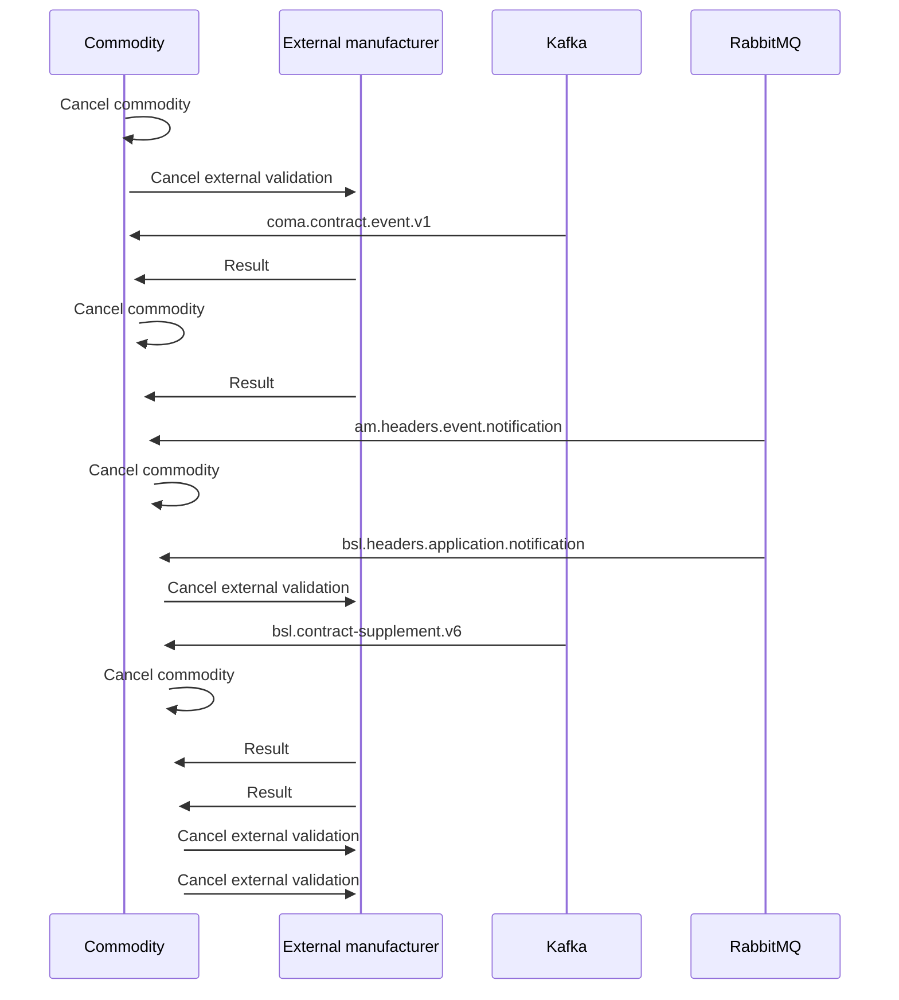

# Commodity cancelation

- **Diagram Type**: Sequence
- **Package**: HomerSelect/BSL/Modules/Commodity/Analytical Model/Commodity Data/Use Case/Commodity cancelation
- **Diagram ID**: 161149
- **Elements**: 8
- **Connectors**: 16

