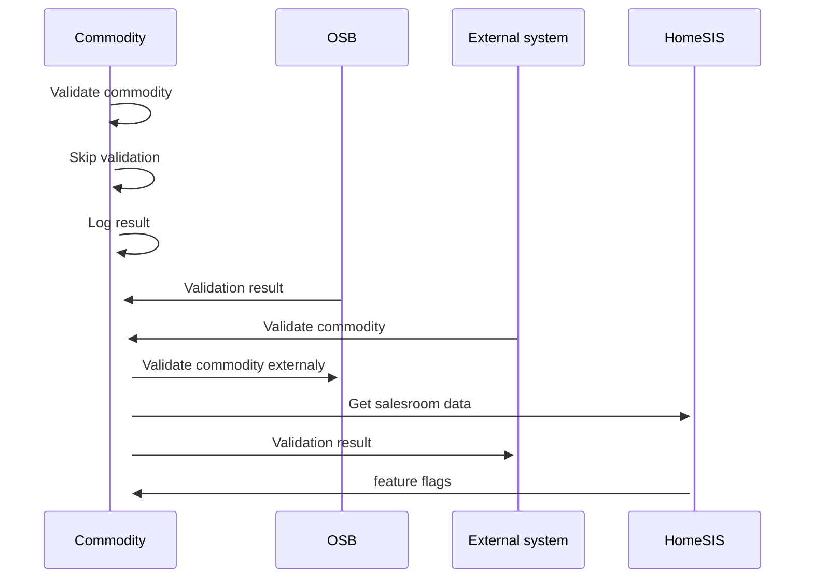

# Commodity validation

- **Diagram Type**: Sequence
- **Package**: HomerSelect/BSL/Modules/Commodity/Analytical Model/Commodity Data/Use Case/Commodity validation
- **Diagram ID**: 161076
- **Elements**: 7
- **Connectors**: 9

