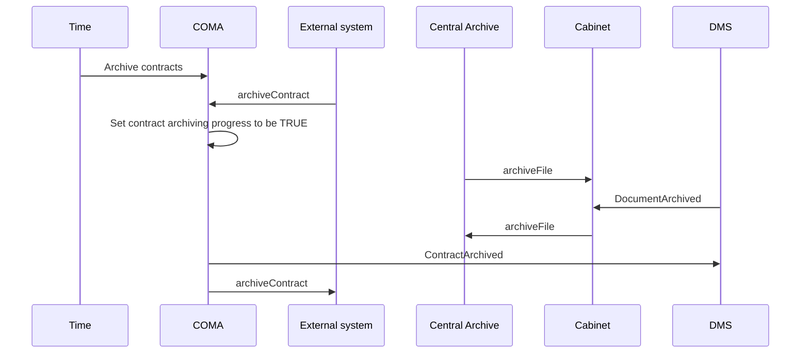

# Archivation process 

```mermaid
sequenceDiagram
    participant Time as Time
    participant COMA as COMA
    participant External_system as External system
    participant Central_Archive as Central Archive
    participant Cabinet as Cabinet
    participant DMS as DMS
    Time->>COMA: Archive contracts
    External_system->>COMA: archiveContract
    COMA->>COMA: Set contract archiving progress to be TRUE
    Central_Archive->>Cabinet: archiveFile
    DMS->>Cabinet: DocumentArchived
    Cabinet->>Central_Archive: archiveFile
    COMA->>DMS: ContractArchived
    COMA->>External_system: archiveContract
```
