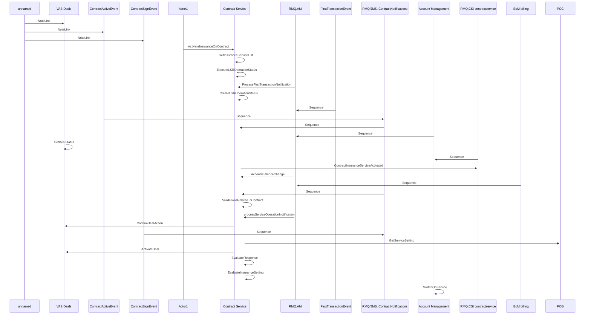

# Activate Insurance service on Contract - Contract Service integration

- **Diagram Type**: Sequence
- **Package**: HomerSelect/BSL/Modules/Contract Services (COS)/Analytical Model/COS interaction diagrams/Activate Insurance service on Contract - Contract Service integration
- **Diagram ID**: 158330
- **Elements**: 18
- **Connectors**: 27

