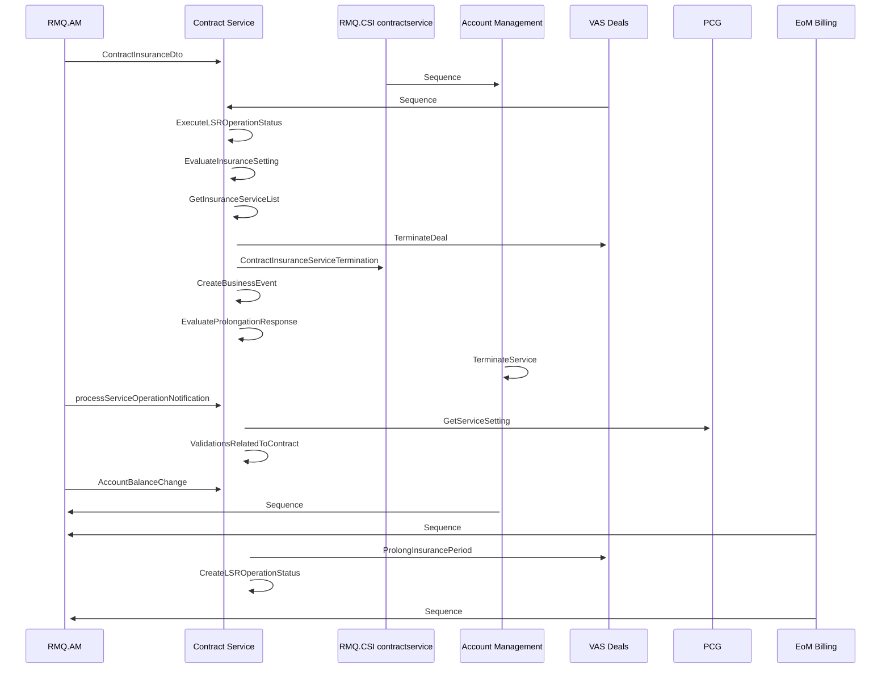

# Prolong Insurance Service on Contract

- **Diagram Type**: Sequence
- **Package**: HomerSelect/BSL/Modules/Contract Services (COS)/Analytical Model/COS interaction diagrams/Prolong Insurance Service on Contract
- **Diagram ID**: 158329
- **Elements**: 13
- **Connectors**: 20

