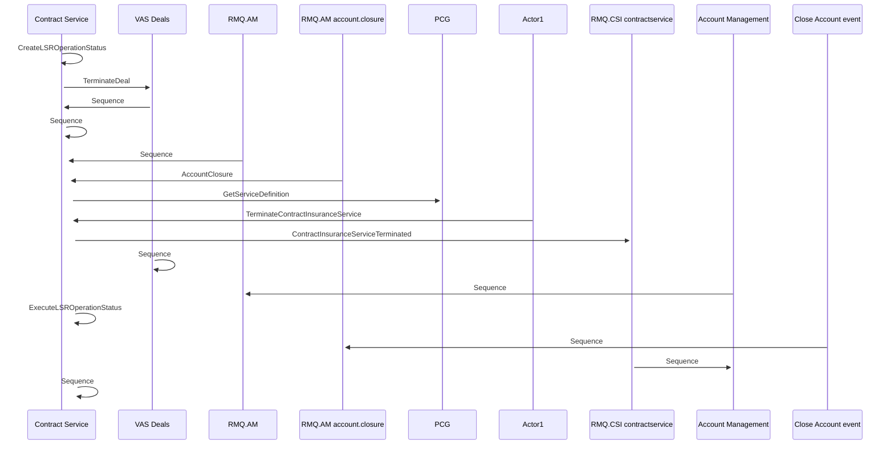

# Terminate Insurance service on Contract - Contract Service integration

- **Diagram Type**: Sequence
- **Package**: HomerSelect/BSL/Modules/Contract Services (COS)/Analytical Model/COS interaction diagrams/Terminate Insurance service on Contract - Contract Service integration
- **Diagram ID**: 158606
- **Elements**: 11
- **Connectors**: 15

