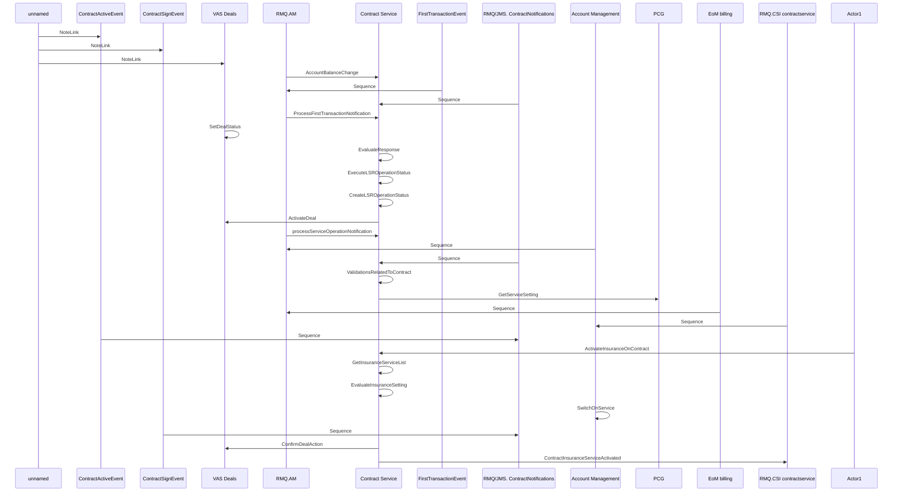

# Activate Insurance service on Contract - Contract Service integration

```mermaid
sequenceDiagram
    participant unnamed as unnamed
    participant ContractActiveEvent as ContractActiveEvent
    participant ContractSignEvent as ContractSignEvent
    participant unnamed as unnamed
    participant VAS_Deals as VAS Deals
    participant RMQ_AM as RMQ.AM
    participant Contract_Service as Contract Service
    participant FirstTransactionEvent as FirstTransactionEvent
    participant RMQ_JMS_ContractNotifications as RMQ/JMS. ContractNotifications
    participant RMQ_AM as RMQ.AM
    participant Account_Management as Account Management
    participant PCG as PCG
    participant EoM_billing as EoM billing
    participant RMQ_CSI_contractservice as RMQ.CSI contractservice
    participant Actor1 as Actor1
    unnamed->>ContractActiveEvent: NoteLink
    unnamed->>ContractSignEvent: NoteLink
    unnamed->>VAS_Deals: NoteLink
    RMQ_AM->>Contract_Service: AccountBalanceChange
    FirstTransactionEvent->>RMQ_AM: Sequence
    RMQ_JMS_ContractNotifications->>Contract_Service: Sequence
    RMQ_AM->>Contract_Service: ProcessFirstTransactionNotification
    VAS_Deals->>VAS_Deals: SetDealStatus
    Contract_Service->>Contract_Service: EvaluateResponse
    Contract_Service->>Contract_Service: ExecuteLSROperationStatus
    Contract_Service->>Contract_Service: CreateLSROperationStatus
    Contract_Service->>VAS_Deals: ActivateDeal
    RMQ_AM->>Contract_Service: processServiceOperationNotification 
    Account_Management->>RMQ_AM: Sequence
    RMQ_JMS_ContractNotifications->>Contract_Service: Sequence
    Contract_Service->>Contract_Service: ValidationsRelatedToContract
    Contract_Service->>PCG: GetServiceSetting
    EoM_billing->>RMQ_AM: Sequence
    RMQ_CSI_contractservice->>Account_Management: Sequence
    ContractActiveEvent->>RMQ_JMS_ContractNotifications: Sequence
    Actor1->>Contract_Service: ActivateInsuranceOnContract
    Contract_Service->>Contract_Service: GetInsuranceServiceList
    Contract_Service->>Contract_Service: EvaluateInsuranceSetting
    Account_Management->>Account_Management: SwitchOnService
    ContractSignEvent->>RMQ_JMS_ContractNotifications: Sequence
    Contract_Service->>VAS_Deals: ConfirmDealAction
    Contract_Service->>RMQ_CSI_contractservice: ContractInsuranceServiceActivated
```
