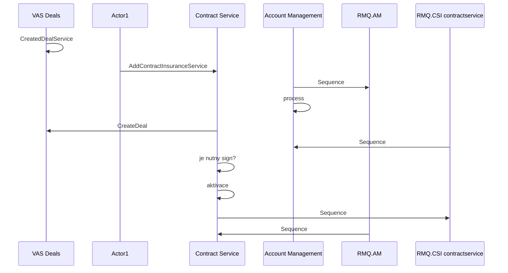

# Add Insurance service to Contract - Contract Service integration

```mermaid
sequenceDiagram
    participant VAS_Deals as VAS Deals
    participant Actor1 as Actor1
    participant Contract_Service as Contract Service
    participant Account_Management as Account Management
    participant RMQ_AM as RMQ.AM
    participant RMQ_CSI_contractservice as RMQ.CSI contractservice
    VAS_Deals->>VAS_Deals: CreatedDealService
    Actor1->>Contract_Service: AddContractInsuranceService
    Account_Management->>RMQ_AM: Sequence
    Account_Management->>Account_Management: process
    Contract_Service->>VAS_Deals: CreateDeal
    RMQ_CSI_contractservice->>Account_Management: Sequence
    Contract_Service->>Contract_Service: je nutny sign?
    Contract_Service->>Contract_Service: aktivace
    Contract_Service->>RMQ_CSI_contractservice: Sequence
    RMQ_AM->>Contract_Service: Sequence
```
