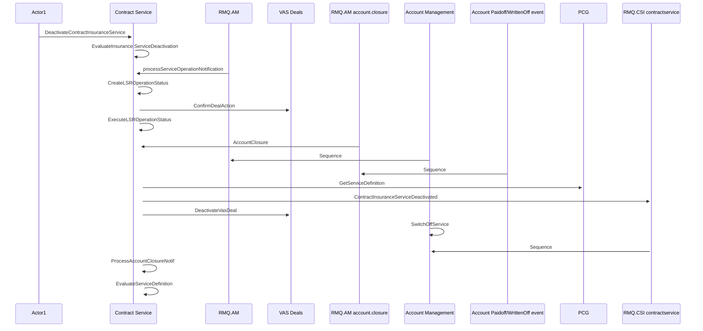

# Deactivate Insurance service on Contract - Contract Service integration

- **Diagram Type**: Sequence
- **Package**: HomerSelect/BSL/Modules/Contract Services (COS_NG)/Analytical Model/COS_NG interaction diagrams/Deactivate Insurance service on Contract - Contract Service integration
- **Diagram ID**: 160172
- **Elements**: 10
- **Connectors**: 16

