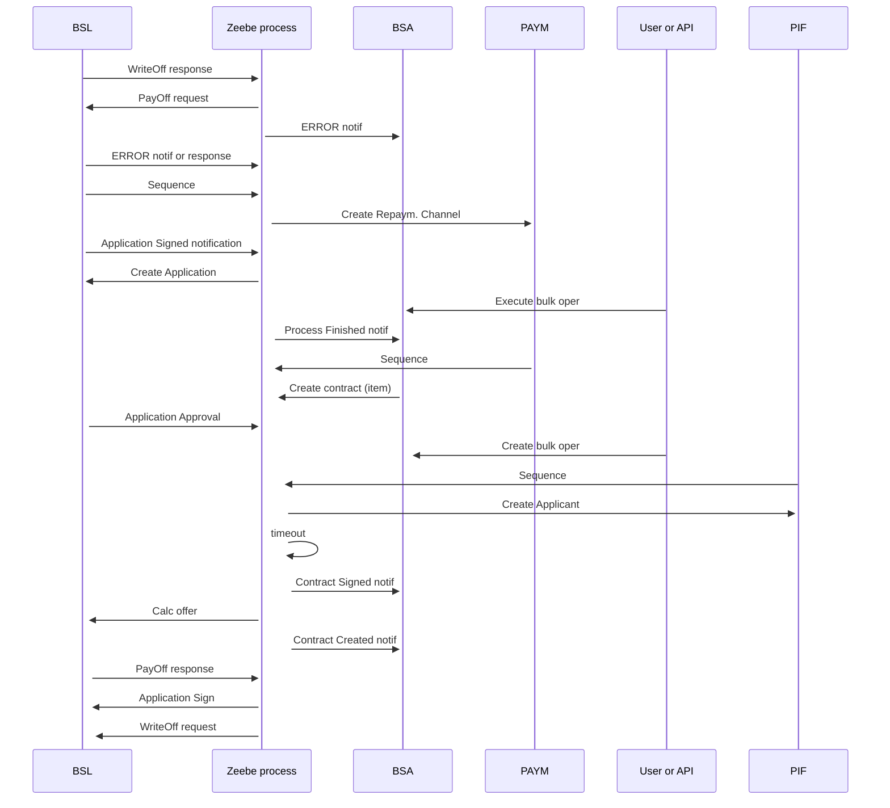

# Debt Purchase support - Interaction dia

- **Diagram Type**: Sequence
- **Package**: HomerSelect/BSL/Modules/Contract bulk operations (BSA)/Requirement model/CBL-30268 (CSI-4570) Debt Purchase support
- **Diagram ID**: 164651
- **Elements**: 7
- **Connectors**: 23

