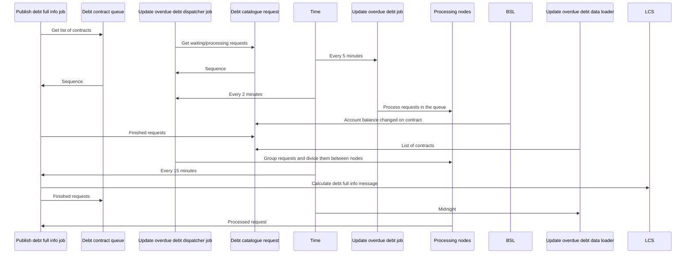

# Scheduled jobs - sequence diagram

```mermaid
sequenceDiagram
    participant Publish_debt_full_info_job as Publish debt full info job
    participant Debt_contract_queue as Debt contract queue
    participant Update_overdue_debt_dispatcher_job as Update overdue debt dispatcher job
    participant Debt_catalogue_request as Debt catalogue request
    participant Time as Time
    participant Update_overdue_debt_job as Update overdue debt job
    participant Processing_nodes as Processing nodes
    participant BSL as BSL
    participant Update_overdue_debt_data_loader as Update overdue debt data loader
    participant LCS as LCS
    Publish_debt_full_info_job->>Debt_contract_queue: Get list of contracts
    Update_overdue_debt_dispatcher_job->>Debt_catalogue_request: Get waiting/processing requests
    Time->>Update_overdue_debt_job: Every 5 minutes
    Debt_catalogue_request->>Update_overdue_debt_dispatcher_job: Sequence
    Debt_contract_queue->>Publish_debt_full_info_job: Sequence
    Time->>Update_overdue_debt_dispatcher_job: Every 2 minutes
    Update_overdue_debt_job->>Processing_nodes: Process requests in the queue
    BSL->>Debt_catalogue_request: Account balance changed on contract
    Publish_debt_full_info_job->>Debt_catalogue_request: Finished requests
    Update_overdue_debt_data_loader->>Debt_catalogue_request: List of contracts
    Update_overdue_debt_dispatcher_job->>Processing_nodes: Group requests and divide them between nodes
    Time->>Publish_debt_full_info_job: Every 15 minutes
    Publish_debt_full_info_job->>LCS: Calculate debt full info message
    Publish_debt_full_info_job->>Debt_contract_queue: Finished requests
    Time->>Update_overdue_debt_data_loader: Midnight
    Processing_nodes->>Publish_debt_full_info_job: Processed request
```
