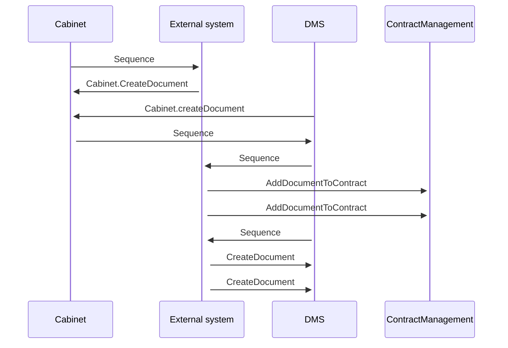

# DMS:Create Document with content - calling variants

- **Diagram Type**: Sequence
- **Package**: HomerSelect/BSL/Modules/Document management (DMS)/Component model
- **Diagram ID**: 162019
- **Elements**: 7
- **Connectors**: 10

