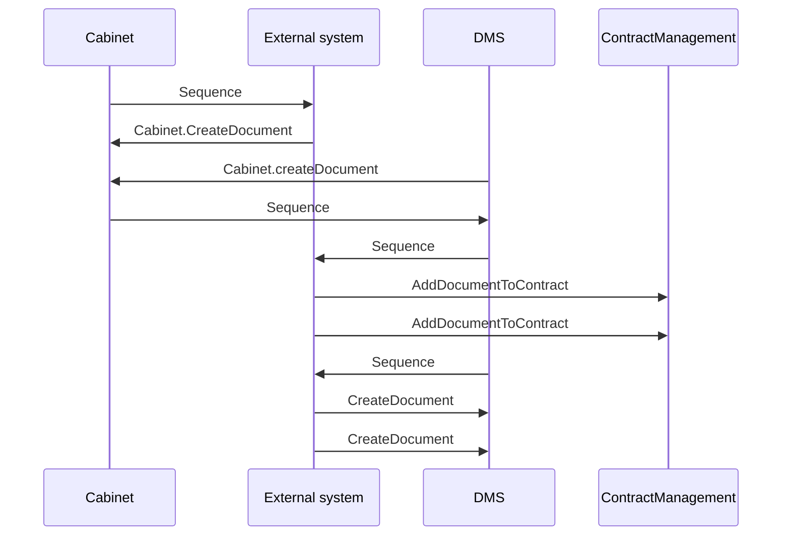

# DMS:Create Document with content - calling variants

```mermaid
sequenceDiagram
    participant Cabinet as Cabinet
    participant External_system as External system
    participant DMS as DMS
    participant ContractManagement as ContractManagement
    Cabinet->>External_system: Sequence
    External_system->>Cabinet: Cabinet.CreateDocument
    DMS->>Cabinet: Cabinet.createDocument
    Cabinet->>DMS: Sequence
    DMS->>External_system: Sequence
    External_system->>ContractManagement: AddDocumentToContract
    External_system->>ContractManagement: AddDocumentToContract
    DMS->>External_system: Sequence
    External_system->>DMS: CreateDocument
    External_system->>DMS: CreateDocument
```
