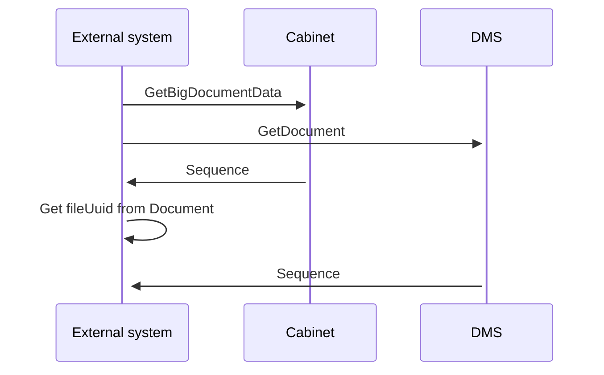

# DMS:How to get Document content

- **Diagram Type**: Sequence
- **Package**: HomerSelect/BSL/Modules/Document management (DMS)/Component model
- **Diagram ID**: 162020
- **Elements**: 3
- **Connectors**: 5

