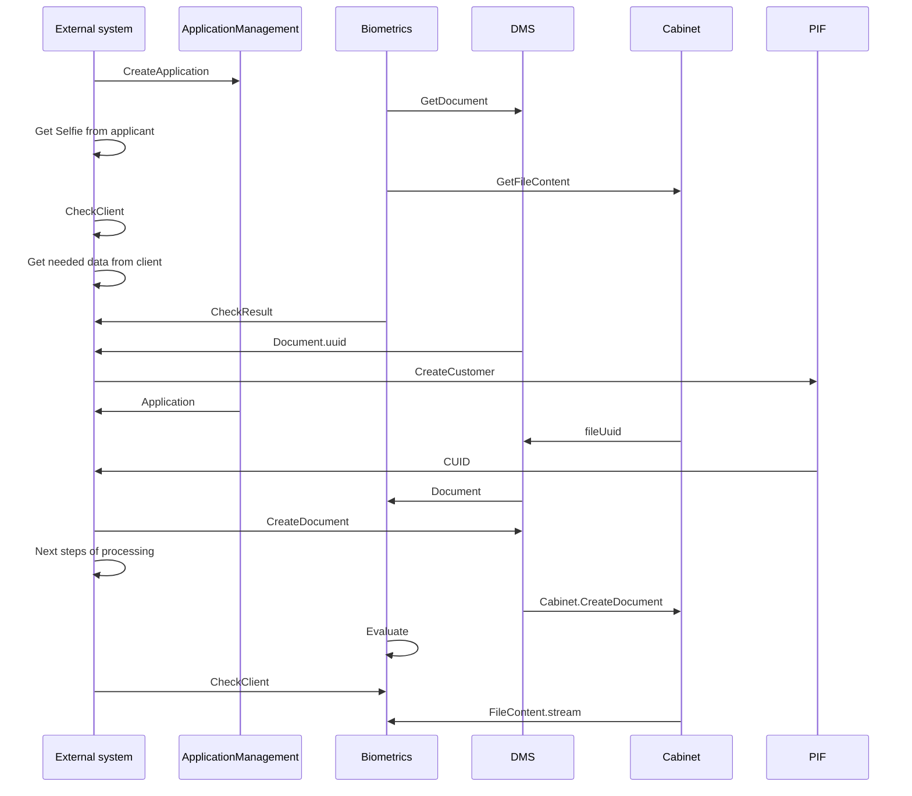

# DMS:Work with Document UUID reference

```mermaid
sequenceDiagram
    participant External_system as External system
    participant ApplicationManagement as ApplicationManagement
    participant Biometrics as Biometrics
    participant DMS as DMS
    participant Cabinet as Cabinet
    participant PIF as PIF
    External_system->>ApplicationManagement: CreateApplication
    Biometrics->>DMS: GetDocument
    External_system->>External_system: Get Selfie from applicant
    Biometrics->>Cabinet: GetFileContent
    External_system->>External_system: CheckClient
    External_system->>External_system: Get needed data from client
    Biometrics->>External_system: CheckResult
    DMS->>External_system: Document.uuid
    External_system->>PIF: CreateCustomer
    ApplicationManagement->>External_system: Application
    Cabinet->>DMS: fileUuid
    PIF->>External_system: CUID
    DMS->>Biometrics: Document
    External_system->>DMS: CreateDocument
    External_system->>External_system: Next steps of processing
    DMS->>Cabinet: Cabinet.CreateDocument
    Biometrics->>Biometrics: Evaluate
    External_system->>Biometrics: CheckClient
    Cabinet->>Biometrics: FileContent.stream
```
