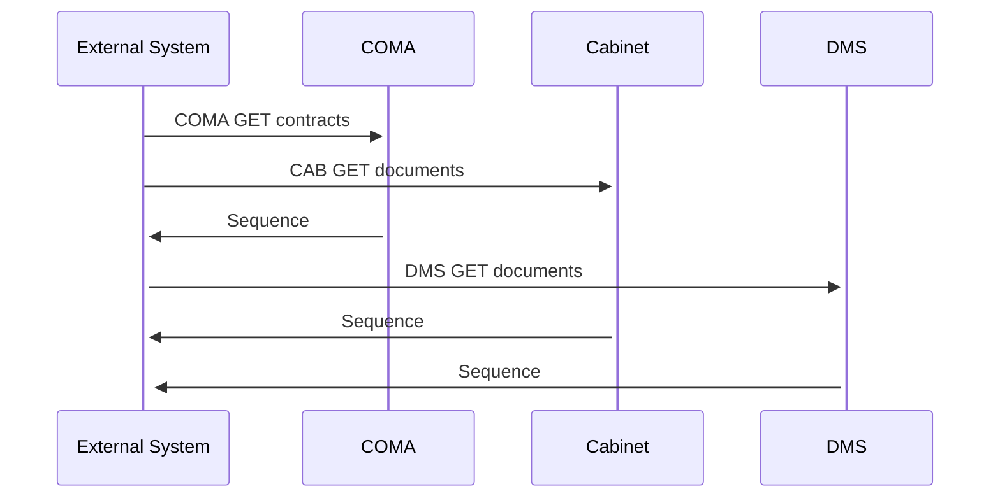

# GetDocumentList

- **Diagram Type**: Sequence
- **Package**: HomerSelect/BSL/Modules/Document management (DMS)/Requirement Model/CBL-16225 (CSI-1363) Replacement ContractDocumentWS methods/GetDocumentList
- **Diagram ID**: 141546
- **Elements**: 4
- **Connectors**: 6

