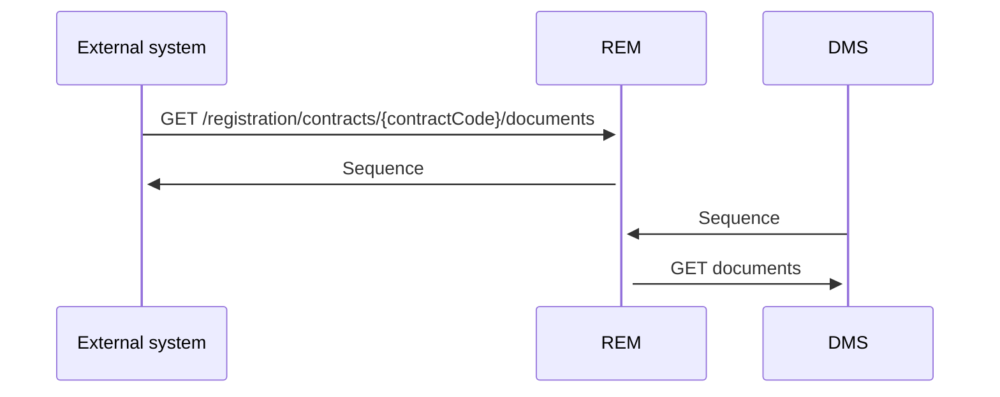

# GetDocumentsForRegistration

- **Diagram Type**: Sequence
- **Package**: HomerSelect/BSL/Modules/Document management (DMS)/Requirement Model/CBL-16225 (CSI-1363) Replacement ContractDocumentWS methods/GetDocumentsForRegistration
- **Diagram ID**: 144217
- **Elements**: 3
- **Connectors**: 4

