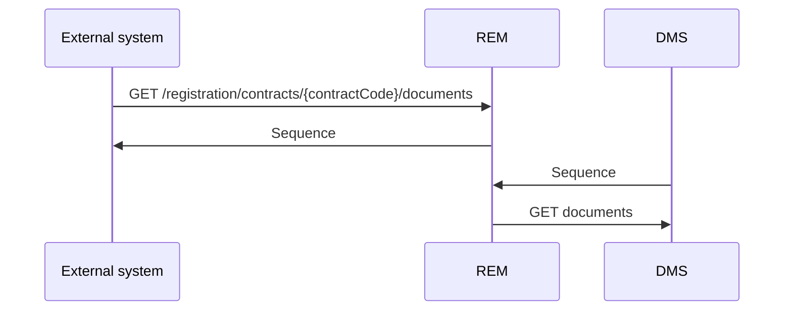

# GetDocumentsForRegistration

```mermaid
sequenceDiagram
    participant External_system as External system
    participant REM as REM
    participant DMS as DMS
    External_system->>REM: GET /registration/contracts/{contractCode}/documents
    REM->>External_system: Sequence
    DMS->>REM: Sequence
    REM->>DMS: GET documents
```
