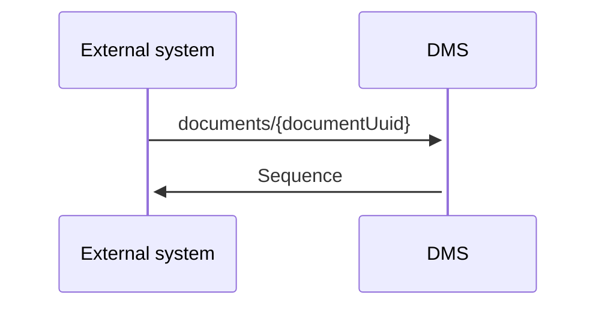

# SetDocumentRegistrationCheck

- **Diagram Type**: Sequence
- **Package**: HomerSelect/BSL/Modules/Document management (DMS)/Requirement Model/CBL-16225 (CSI-1363) Replacement ContractDocumentWS methods/SetDocumentRegistrationCheck
- **Diagram ID**: 141548
- **Elements**: 2
- **Connectors**: 2

