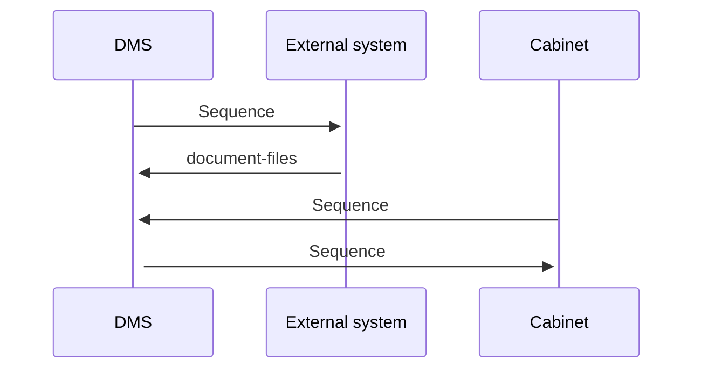

# UploadDocumentFile

- **Diagram Type**: Sequence
- **Package**: HomerSelect/BSL/Modules/Document management (DMS)/Requirement Model/CBL-16225 (CSI-1363) Replacement ContractDocumentWS methods/UploadDocumentFile
- **Diagram ID**: 141667
- **Elements**: 3
- **Connectors**: 4

