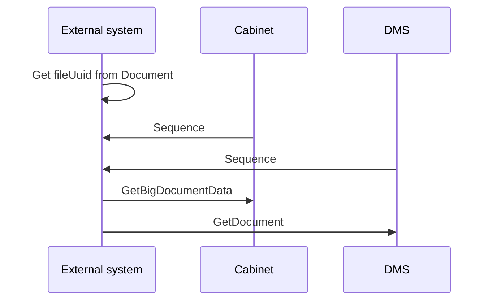

# DMS:How to get Document content

```mermaid
sequenceDiagram
    participant External_system as External system
    participant Cabinet as Cabinet
    participant DMS as DMS
    External_system->>External_system: Get fileUuid from Document
    Cabinet->>External_system: Sequence
    DMS->>External_system: Sequence
    External_system->>Cabinet: GetBigDocumentData
    External_system->>DMS: GetDocument
```
