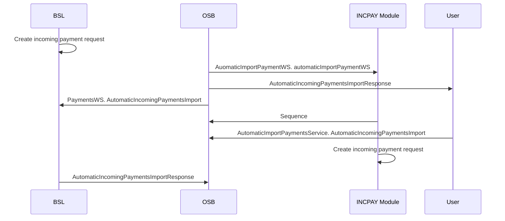

# 01 Bulk import of payments (asynchronous)

```mermaid
sequenceDiagram
    participant BSL as BSL
    participant OSB as OSB
    participant INCPAY_Module as INCPAY Module
    participant User as User
    BSL->>BSL: Create incoming payment request
    OSB->>INCPAY_Module: AuomaticImportPaymentWS. automaticImportPaymentWS
    OSB->>User: AutomaticIncomingPaymentsImportResponse
    OSB->>BSL: PaymentsWS. AutomaticIncomingPaymentsImport
    INCPAY_Module->>OSB: Sequence
    User->>OSB: AutomaticImportPaymentsService. AutomaticIncomingPaymentsImport
    INCPAY_Module->>INCPAY_Module: Create incoming payment request
    BSL->>OSB: AutomaticIncomingPaymentsImportResponse
```
