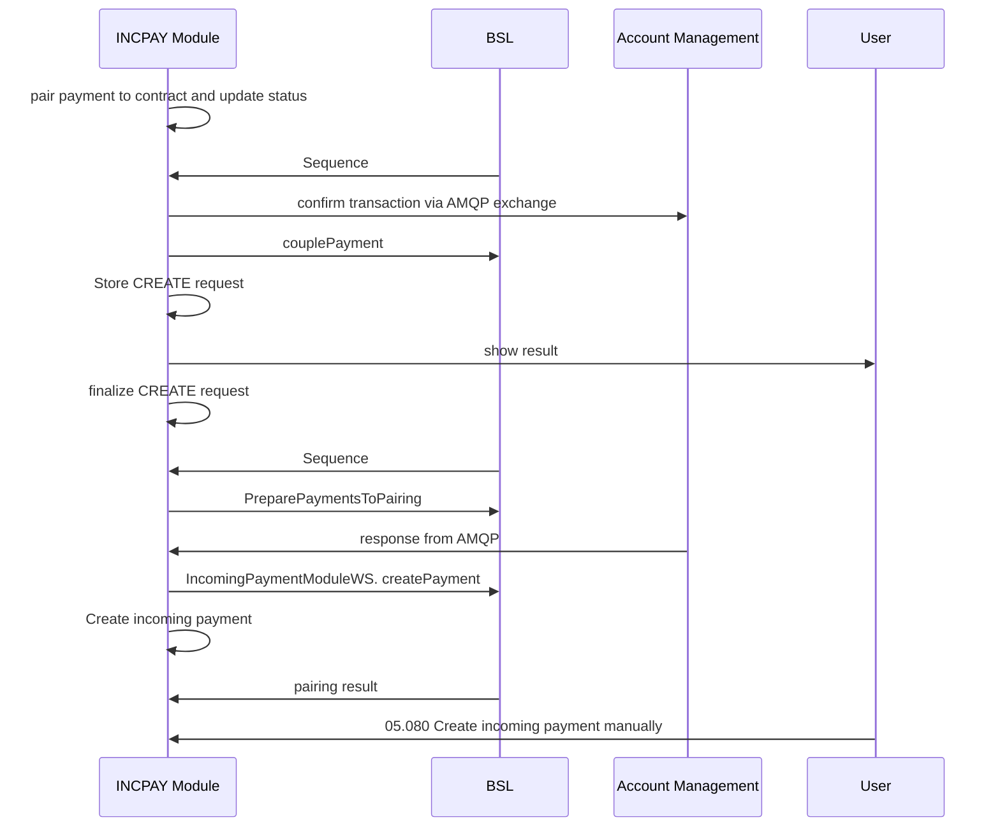

# 02 Create single incoming payment (GUI)

```mermaid
sequenceDiagram
    participant INCPAY_Module as INCPAY Module
    participant BSL as BSL
    participant Account_Management as Account Management
    participant User as User
    INCPAY_Module->>INCPAY_Module: pair payment to contract and update status
    BSL->>INCPAY_Module: Sequence
    INCPAY_Module->>Account_Management: confirm transaction via AMQP exchange
    INCPAY_Module->>BSL: couplePayment
    INCPAY_Module->>INCPAY_Module: Store CREATE request
    INCPAY_Module->>User: show result
    INCPAY_Module->>INCPAY_Module: finalize CREATE request
    BSL->>INCPAY_Module: Sequence
    INCPAY_Module->>BSL: PreparePaymentsToPairing
    Account_Management->>INCPAY_Module: response from AMQP
    INCPAY_Module->>BSL: IncomingPaymentModuleWS. createPayment
    INCPAY_Module->>INCPAY_Module: Create incoming payment
    BSL->>INCPAY_Module: pairing result
    User->>INCPAY_Module: 05.080 Create incoming payment manually
```
