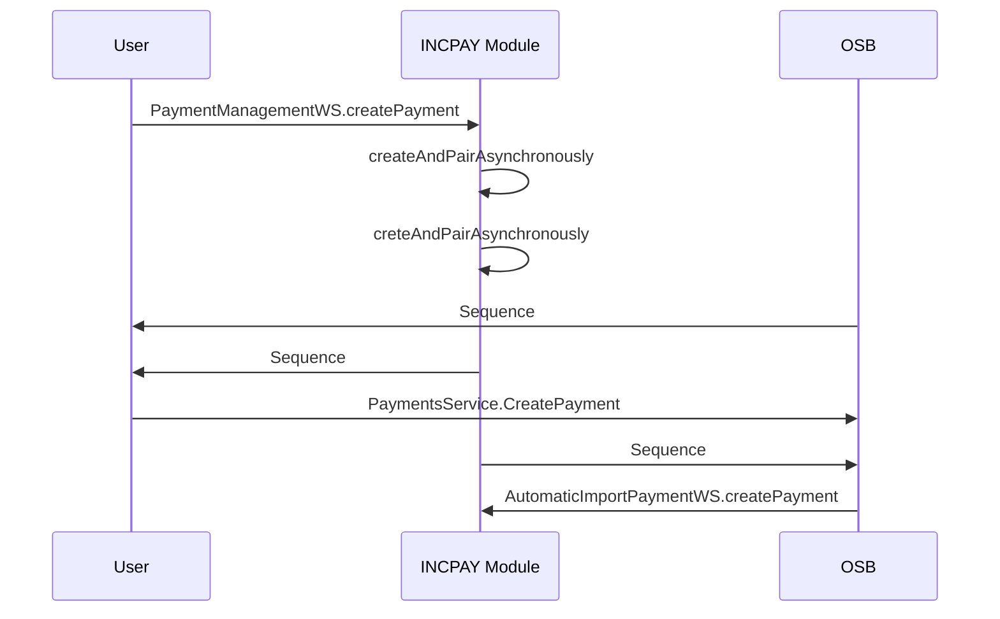

# 03 Create single incoming payment (API)

```mermaid
sequenceDiagram
    participant User as User
    participant INCPAY_Module as INCPAY Module
    participant OSB as OSB
    User->>INCPAY_Module: PaymentManagementWS.createPayment
    INCPAY_Module->>INCPAY_Module: createAndPairAsynchronously
    INCPAY_Module->>INCPAY_Module: creteAndPairAsynchronously
    OSB->>User: Sequence
    INCPAY_Module->>User: Sequence
    User->>OSB: PaymentsService.CreatePayment
    INCPAY_Module->>OSB: Sequence
    OSB->>INCPAY_Module: AutomaticImportPaymentWS.createPayment
```
