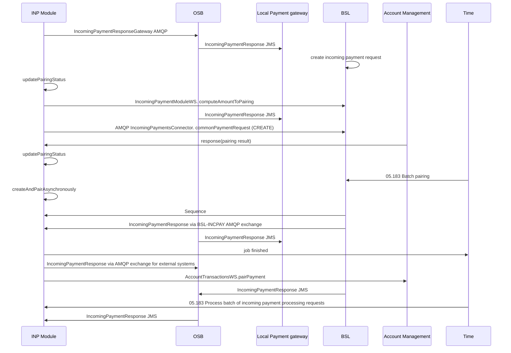

# 04 Process incoming payment requests

```mermaid
sequenceDiagram
    participant INP_Module as INP Module
    participant OSB as OSB
    participant Local_Payment_gateway as Local Payment gateway
    participant BSL as BSL
    participant Account_Management as Account Management
    participant Time as Time
    INP_Module->>OSB: IncomingPaymentResponseGateway AMQP
    OSB->>Local_Payment_gateway: IncomingPaymentResponse JMS
    BSL->>BSL: create incoming payment request
    INP_Module->>INP_Module: updatePairingStatus
    INP_Module->>BSL: IncomingPaymentModuleWS. computeAmountToPairing
    OSB->>Local_Payment_gateway: IncomingPaymentResponse JMS
    INP_Module->>BSL: AMQP IncomingPaymentsConnector. commonPaymentRequest (CREATE)
    Account_Management->>INP_Module: response(pairing result)
    INP_Module->>INP_Module: updatePairingStatus
    Time->>BSL: 05.183 Batch pairing
    INP_Module->>INP_Module: createAndPairAsynchronously
    BSL->>INP_Module: Sequence
    BSL->>INP_Module: IncomingPaymentResponse via BSL-INCPAY AMQP exchange
    OSB->>Local_Payment_gateway: IncomingPaymentResponse JMS
    INP_Module->>Time: job finished
    INP_Module->>OSB: IncomingPaymentResponse via AMQP exchange for external systems
    INP_Module->>Account_Management: AccountTransactionsWS.pairPayment
    BSL->>OSB: IncomingPaymentResponse JMS
    Time->>INP_Module: 05.183 Process batch of incoming payment processing requests
    OSB->>INP_Module: IncomingPaymentResponse JMS
```
