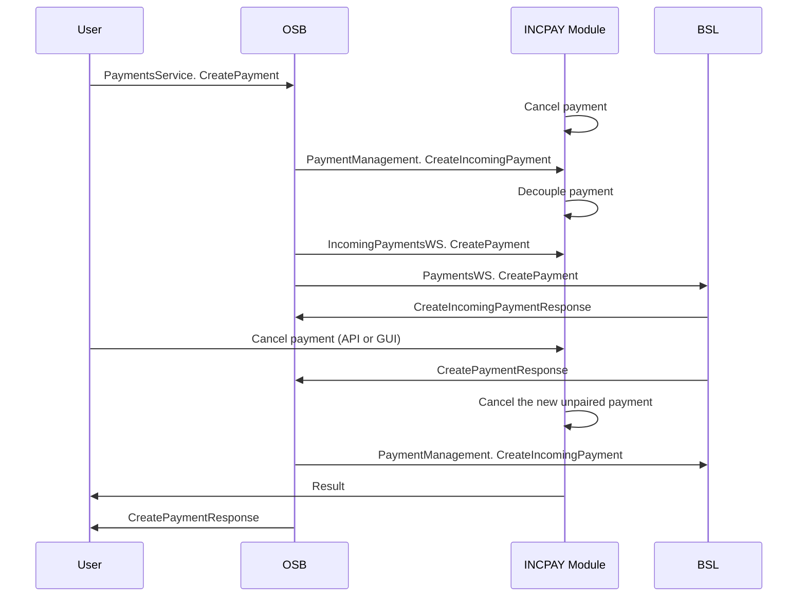

# 05a Cancel incoming payment via GUI (synchronous)

```mermaid
sequenceDiagram
    participant User as User
    participant OSB as OSB
    participant INCPAY_Module as INCPAY Module
    participant BSL as BSL
    User->>OSB: PaymentsService. CreatePayment
    INCPAY_Module->>INCPAY_Module: Cancel payment
    OSB->>INCPAY_Module: PaymentManagement. CreateIncomingPayment
    INCPAY_Module->>INCPAY_Module: Decouple payment
    OSB->>INCPAY_Module: IncomingPaymentsWS. CreatePayment
    OSB->>BSL: PaymentsWS. CreatePayment
    BSL->>OSB: CreateIncomingPaymentResponse
    User->>INCPAY_Module: Cancel payment (API or GUI)
    BSL->>OSB: CreatePaymentResponse
    INCPAY_Module->>INCPAY_Module: Cancel the new unpaired payment
    OSB->>BSL: PaymentManagement. CreateIncomingPayment
    INCPAY_Module->>User: Result
    OSB->>User: CreatePaymentResponse
```
