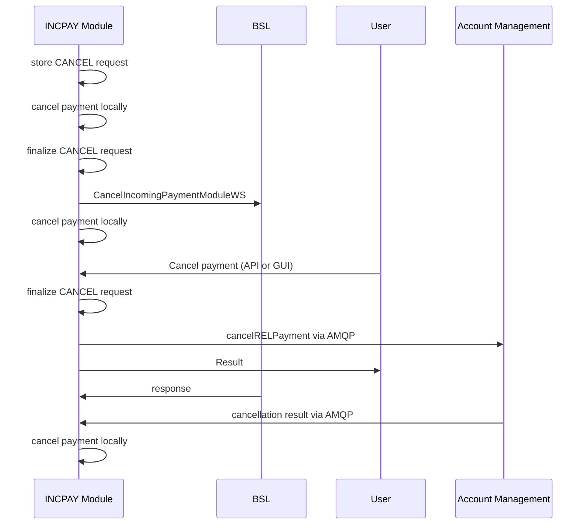

# 05b Cancel incoming payment via GUI (Asynchronous)

```mermaid
sequenceDiagram
    participant INCPAY_Module as INCPAY Module
    participant BSL as BSL
    participant User as User
    participant Account_Management as Account Management
    INCPAY_Module->>INCPAY_Module: store CANCEL request
    INCPAY_Module->>INCPAY_Module: cancel payment locally
    INCPAY_Module->>INCPAY_Module: finalize CANCEL request
    INCPAY_Module->>BSL: CancelIncomingPaymentModuleWS
    INCPAY_Module->>INCPAY_Module: cancel payment locally
    User->>INCPAY_Module: Cancel payment (API or GUI)
    INCPAY_Module->>INCPAY_Module: finalize CANCEL request
    INCPAY_Module->>Account_Management: cancelRELPayment via AMQP
    INCPAY_Module->>User: Result
    BSL->>INCPAY_Module: response
    Account_Management->>INCPAY_Module: cancellation result via AMQP
    INCPAY_Module->>INCPAY_Module: cancel payment locally
```
