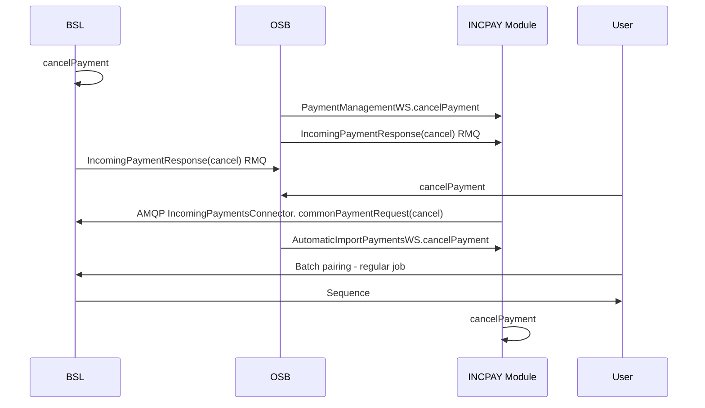

# 06 Cancel payment via API (asynchronous)

```mermaid
sequenceDiagram
    participant BSL as BSL
    participant OSB as OSB
    participant INCPAY_Module as INCPAY Module
    participant User as User
    BSL->>BSL: cancelPayment
    OSB->>INCPAY_Module: PaymentManagementWS.cancelPayment
    OSB->>INCPAY_Module: IncomingPaymentResponse(cancel) RMQ
    BSL->>OSB: IncomingPaymentResponse(cancel) RMQ
    User->>OSB: cancelPayment
    INCPAY_Module->>BSL: AMQP IncomingPaymentsConnector. commonPaymentRequest(cancel)
    OSB->>INCPAY_Module: AutomaticImportPaymentsWS.cancelPayment
    User->>BSL: Batch pairing - regular job
    BSL->>User: Sequence
    INCPAY_Module->>INCPAY_Module: cancelPayment
```
