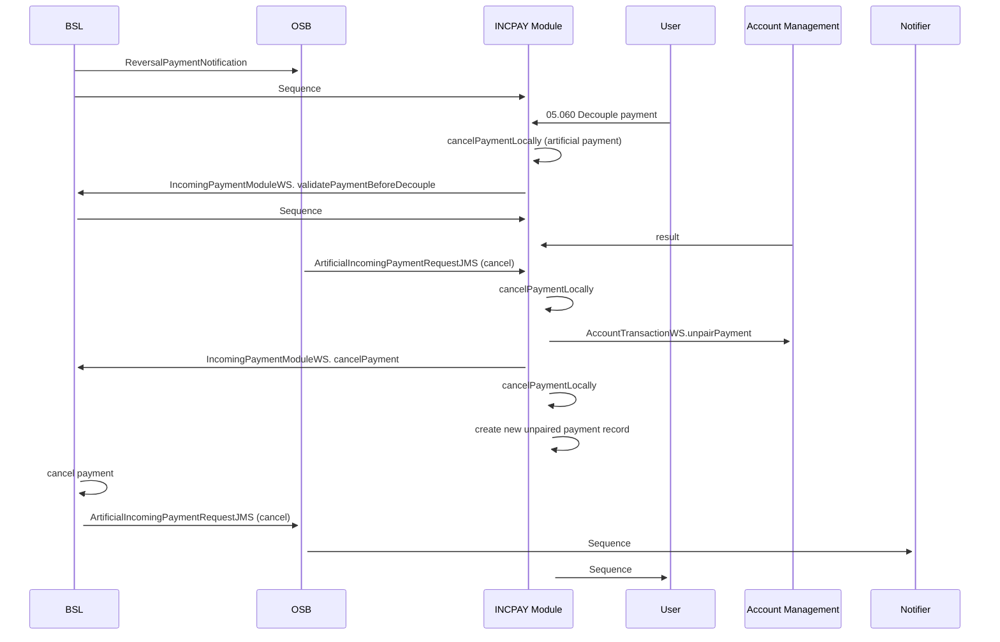

# 07a Decouple payment (Synchronous)

- **Diagram Type**: Sequence
- **Package**: HomerSelect/BSL/Modules/Incoming Payments/Analytical Model/Interaction Diagrams
- **Diagram ID**: 162668
- **Elements**: 12
- **Connectors**: 17

