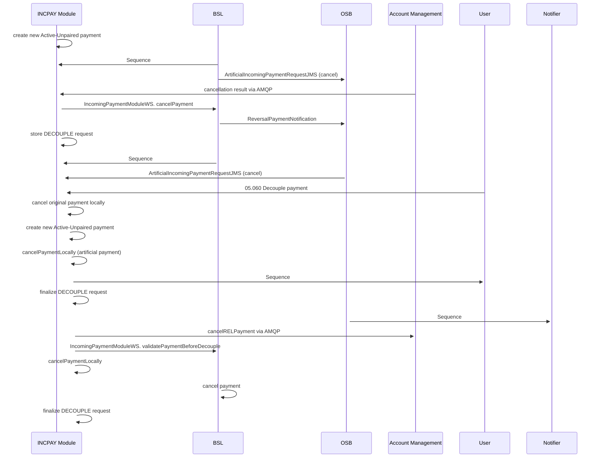

# 07b Decouple payment (Asynchronous)

- **Diagram Type**: Sequence
- **Package**: HomerSelect/BSL/Modules/Incoming Payments/Analytical Model/Interaction Diagrams
- **Diagram ID**: 162673
- **Elements**: 12
- **Connectors**: 21

