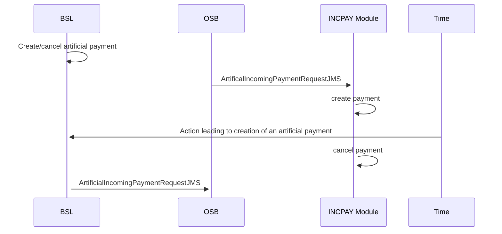

# 08 Creation of artificial payments

- **Diagram Type**: Sequence
- **Package**: HomerSelect/BSL/Modules/Incoming Payments/Analytical Model/Interaction Diagrams
- **Diagram ID**: 162669
- **Elements**: 6
- **Connectors**: 6

