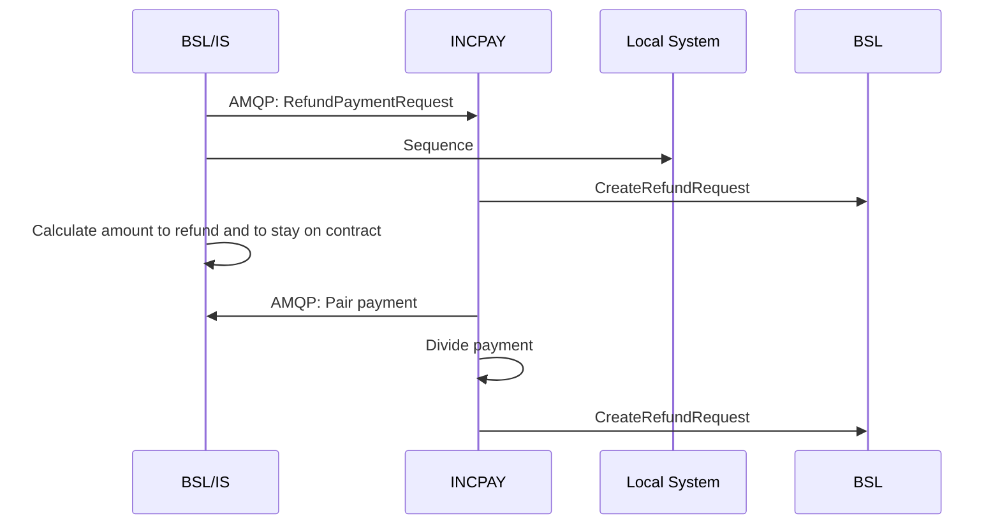

# Cancel Overpayment

```mermaid
sequenceDiagram
    participant BSL_IS as BSL/IS
    participant INCPAY as INCPAY
    participant Local_System as Local System
    participant BSL as BSL
    BSL_IS->>INCPAY: AMQP: RefundPaymentRequest
    BSL_IS->>Local_System: Sequence
    INCPAY->>BSL: CreateRefundRequest
    BSL_IS->>BSL_IS: Calculate amount to refund and to stay on contract
    INCPAY->>BSL_IS: AMQP: Pair payment
    INCPAY->>INCPAY: Divide payment
    INCPAY->>BSL: CreateRefundRequest
```
