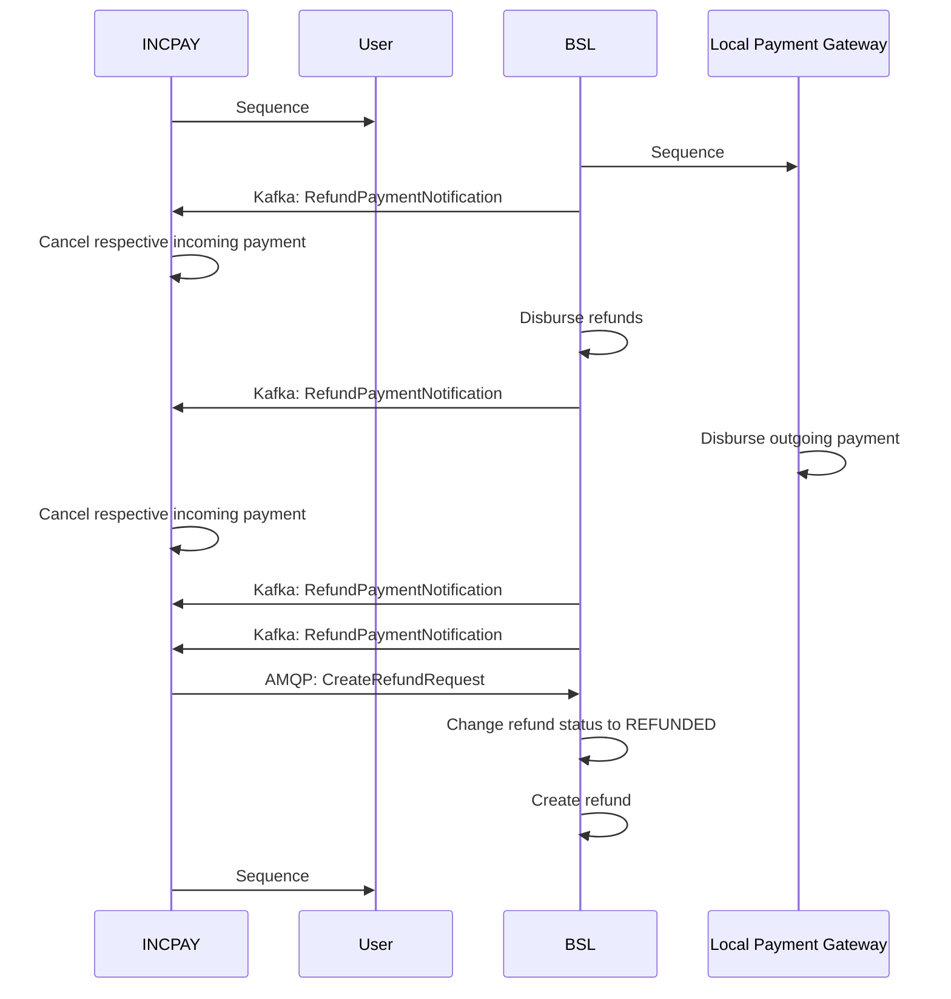

# Refunds 

```mermaid
sequenceDiagram
    participant INCPAY as INCPAY
    participant User as User
    participant BSL as BSL
    participant Local_Payment_Gateway as Local Payment Gateway
    INCPAY->>User: Sequence
    BSL->>Local_Payment_Gateway: Sequence
    BSL->>INCPAY: Kafka: RefundPaymentNotification
    INCPAY->>INCPAY: Cancel respective incoming payment
    BSL->>BSL: Disburse refunds
    BSL->>INCPAY: Kafka: RefundPaymentNotification
    Local_Payment_Gateway->>Local_Payment_Gateway: Disburse outgoing payment
    INCPAY->>INCPAY: Cancel respective incoming payment
    BSL->>INCPAY: Kafka: RefundPaymentNotification
    BSL->>INCPAY: Kafka: RefundPaymentNotification
    INCPAY->>BSL: AMQP: CreateRefundRequest
    BSL->>BSL: Change refund status to REFUNDED
    BSL->>BSL: Create refund
    INCPAY->>User: Sequence
```
