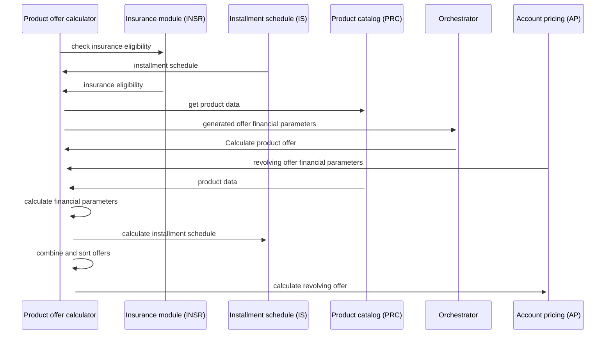

# Sequence diagram

- **Diagram Type**: Sequence
- **Package**: HomerSelect/BSL/Modules/Product Calculator/Analytical Model/Product Calculator Engine/Sequence diagram
- **Diagram ID**: 162643
- **Elements**: 8
- **Connectors**: 12

