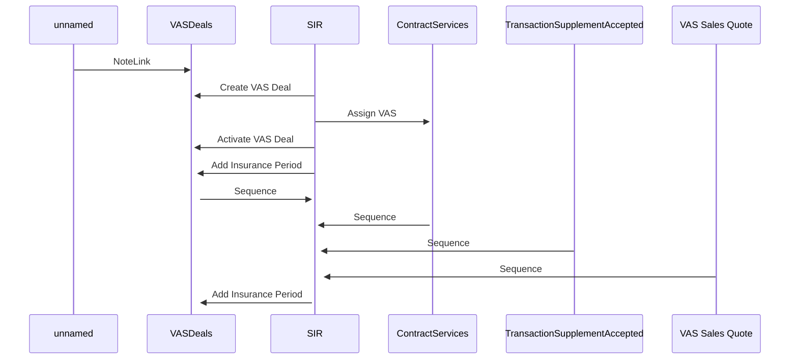

# SIR_Contract_Insurance_Service_creation_seq

- **Diagram Type**: Sequence
- **Package**: HomerSelect/BSL/Modules/Service Interpreter (SIR_NG)/Analytical Model/Use Case Model/Service Interpreter (SIR_NG) - interaction diagrams/SIR_Contract_Insurance_Service_creation_seq
- **Diagram ID**: 160387
- **Elements**: 6
- **Connectors**: 10

