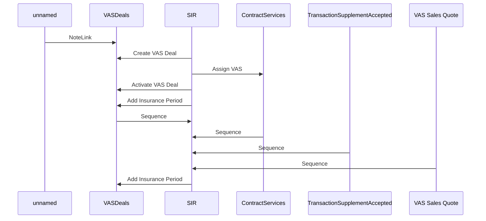

# SIR_Contract_Insurance_Service_creation_seq

```mermaid
sequenceDiagram
    participant unnamed as unnamed
    participant VASDeals as VASDeals
    participant SIR as SIR
    participant ContractServices as ContractServices
    participant TransactionSupplementAccepted as TransactionSupplementAccepted
    participant VAS_Sales_Quote as VAS Sales Quote
    unnamed->>VASDeals: NoteLink
    SIR->>VASDeals: Create VAS Deal
    SIR->>ContractServices: Assign VAS
    SIR->>VASDeals: Activate VAS Deal
    SIR->>VASDeals: Add Insurance Period
    VASDeals->>SIR: Sequence
    ContractServices->>SIR: Sequence
    TransactionSupplementAccepted->>SIR: Sequence
    VAS_Sales_Quote->>SIR: Sequence
    SIR->>VASDeals: Add Insurance Period
```
