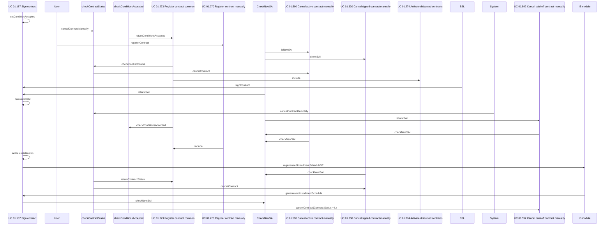

# newSAI E2T

```mermaid
sequenceDiagram
    participant UC_01_187_Sign_contract as UC 01.187 Sign contract
    participant User as User
    participant checkContractStatus as checkContractStatus
    participant checkConditionsAccepted as checkConditionsAccepted
    participant UC_01_273_Register_contract_common as UC 01.273 Register contract common
    participant UC_01_270_Register_contract_manually as UC 01.270 Register contract manually
    participant CheckNewSAI as CheckNewSAI
    participant UC_01_590_Cancel_active_contract_manually as UC 01.590 Cancel active contract manually
    participant UC_01_330_Cancel_signed_contract_manually as UC 01.330 Cancel signed contract manually
    participant UC_01_274_Activate_disbursed_contracts as UC 01.274 Activate disbursed contracts
    participant BSL as BSL
    participant System as System
    participant UC_01_592_Cancel_paid_off_contract_manually as UC 01.592 Cancel paid-off contract manually
    participant IS_module as IS module
    UC_01_187_Sign_contract->>UC_01_187_Sign_contract: setConditionAccepted
    User->>checkContractStatus: cancelContractManually
    checkConditionsAccepted->>UC_01_273_Register_contract_common: returnConditionsAccepted
    User->>UC_01_270_Register_contract_manually: registerContract
    CheckNewSAI->>UC_01_590_Cancel_active_contract_manually: isNewSAI
    CheckNewSAI->>UC_01_330_Cancel_signed_contract_manually: isNewSAI
    UC_01_273_Register_contract_common->>checkContractStatus: checkContractStatus
    checkContractStatus->>UC_01_590_Cancel_active_contract_manually: cancelContract
    UC_01_273_Register_contract_common->>UC_01_274_Activate_disbursed_contracts: include
    BSL->>UC_01_187_Sign_contract: signContract
    CheckNewSAI->>UC_01_187_Sign_contract: isNewSAI
    UC_01_187_Sign_contract->>UC_01_187_Sign_contract: calculateDebt
    System->>checkContractStatus: cancelContractRemotely
    CheckNewSAI->>UC_01_592_Cancel_paid_off_contract_manually: isNewSAI
    UC_01_273_Register_contract_common->>checkConditionsAccepted: checkConditionsAccepted
    UC_01_592_Cancel_paid_off_contract_manually->>CheckNewSAI: checkNewSAI
    UC_01_590_Cancel_active_contract_manually->>CheckNewSAI: checkNewSAI
    UC_01_270_Register_contract_manually->>UC_01_273_Register_contract_common: include
    UC_01_187_Sign_contract->>UC_01_187_Sign_contract: setHasInstallments
    UC_01_187_Sign_contract->>IS_module: regeneratedInstallmentScheduleSE
    UC_01_330_Cancel_signed_contract_manually->>CheckNewSAI: checkNewSAI
    checkContractStatus->>UC_01_273_Register_contract_common: returnContractStatus
    checkContractStatus->>UC_01_330_Cancel_signed_contract_manually: cancelContract
    IS_module->>UC_01_187_Sign_contract: genereratedInstallmentSchedule
    UC_01_187_Sign_contract->>CheckNewSAI: checkNewSAI
    checkContractStatus->>UC_01_592_Cancel_paid_off_contract_manually: cancelContract(Contract.Status = L)
```
