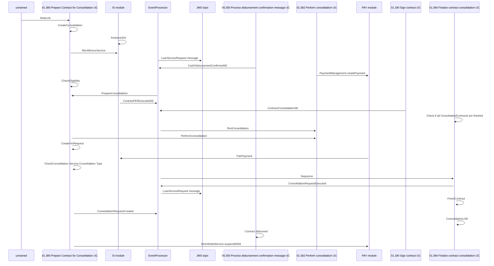

# Consolidation - CLM part sequence diagram

- **Diagram Type**: Sequence
- **Package**: HomerSelect/BSL/Requirements Model/Finished/CLM/CLM-93 (CBL-29) Consolidation (Top-up) for cash loans/Consolidation - CLM part sequence diagram
- **Diagram ID**: 84606
- **Elements**: 15
- **Connectors**: 25

