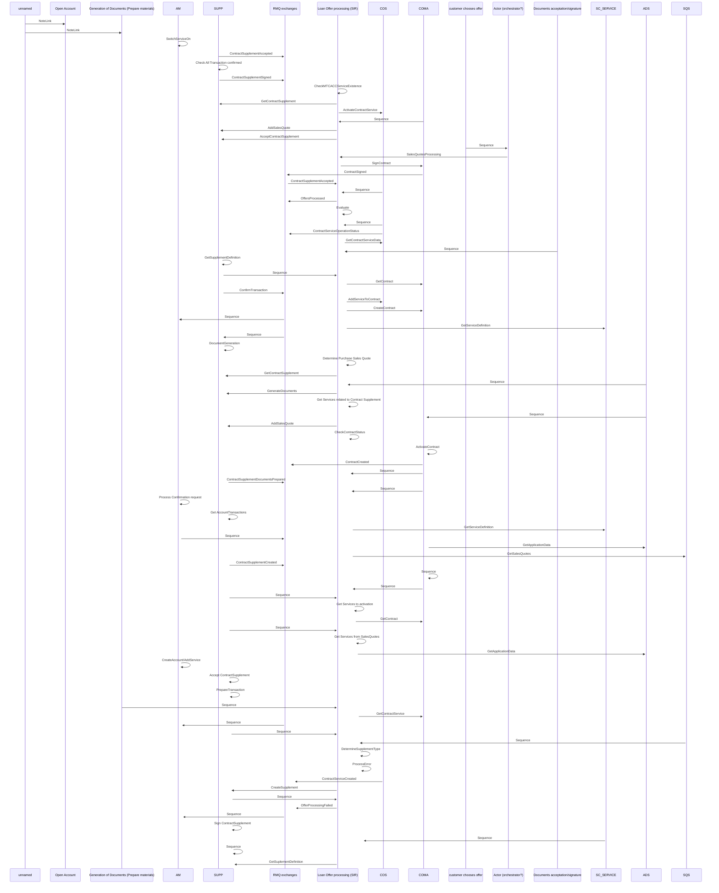

# Loan application processing - seq

- **Diagram Type**: Sequence
- **Package**: HomerSelect/BSL/Requirements Model/Finished/CSI/BREIT-35 HoSel as a Product - Applications Phase 1/Loan application processing - seq
- **Diagram ID**: 159936
- **Elements**: 22
- **Connectors**: 81

