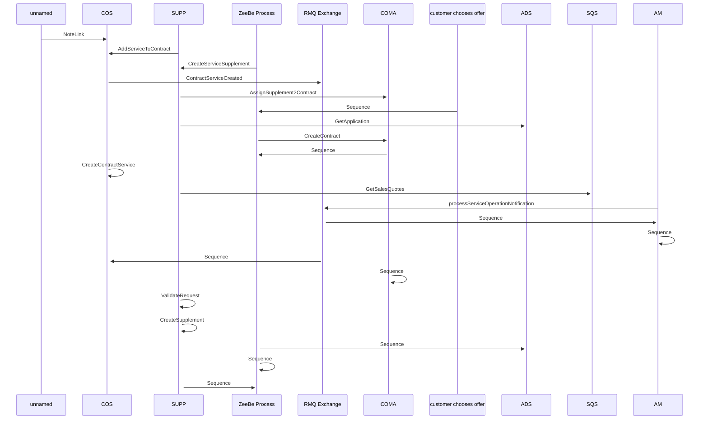

# SME Contract Management

- **Diagram Type**: Sequence
- **Package**: HomerSelect/BSL/Requirements Model/Finished/CSI/CBL-22777 (CSI-3042) SME Project - Additional Cards for SME account/SME Contract Management
- **Diagram ID**: 157823
- **Elements**: 10
- **Connectors**: 21

