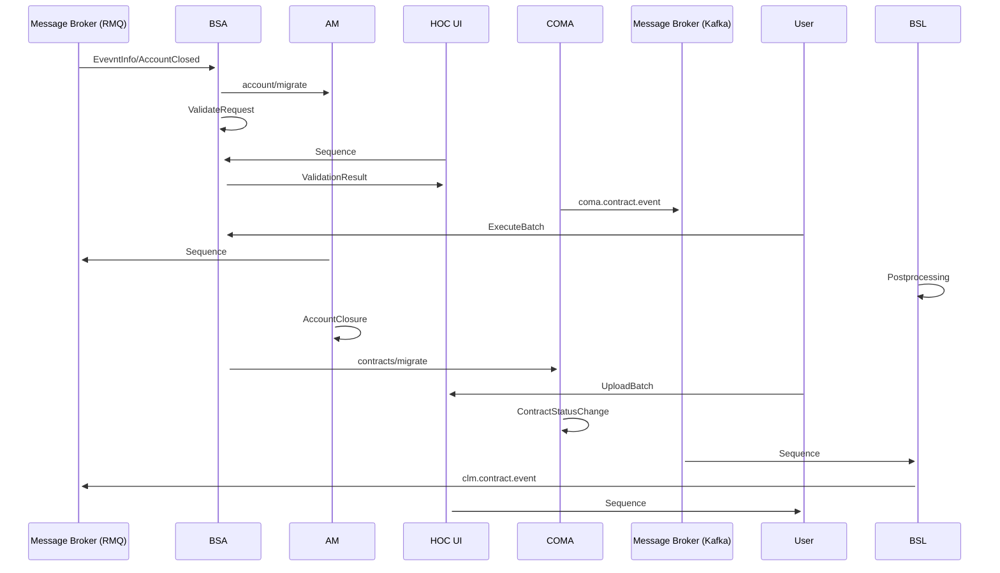

# Sequence diagram

- **Diagram Type**: Sequence
- **Package**: HomerSelect/BSL/Requirements Model/In process/CLM/CBL-31177 BRIN-1182 - Marking for contract as migrated in Hosel/Sequence diagram
- **Diagram ID**: 164663
- **Elements**: 9
- **Connectors**: 16

