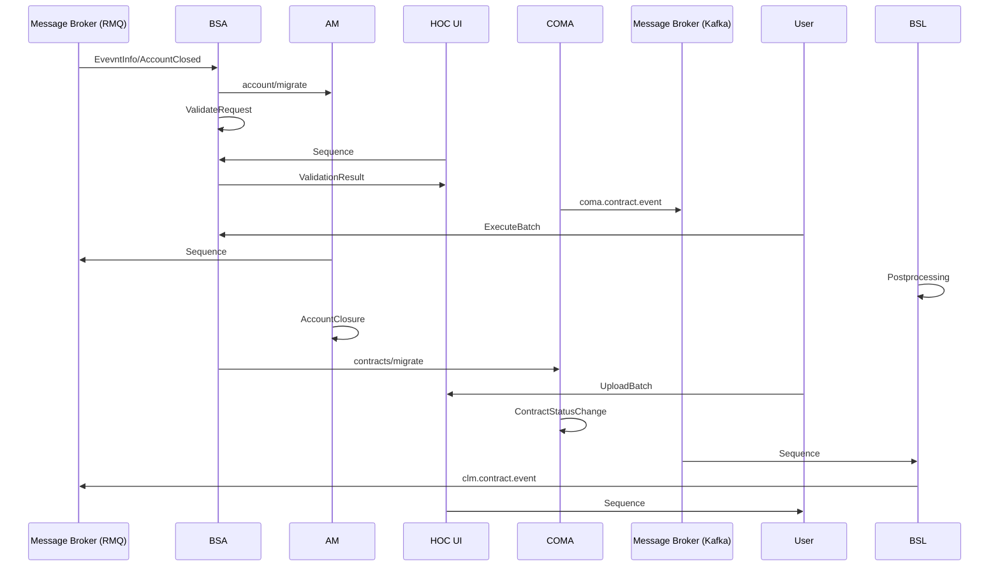

# Sequence diagram

```mermaid
sequenceDiagram
    participant Message_Broker_RMQ as Message Broker (RMQ)
    participant BSA as BSA
    participant AM as AM
    participant HOC_UI as HOC UI
    participant COMA as COMA
    participant Message_Broker_Kafka as Message Broker (Kafka)
    participant User as User
    participant BSL as BSL
    Message_Broker_RMQ->>BSA: EvevntInfo/AccountClosed
    BSA->>AM: account/migrate
    BSA->>BSA: ValidateRequest
    HOC_UI->>BSA: Sequence
    BSA->>HOC_UI: ValidationResult
    COMA->>Message_Broker_Kafka: coma.contract.event
    User->>BSA: ExecuteBatch
    AM->>Message_Broker_RMQ: Sequence
    BSL->>BSL: Postprocessing
    AM->>AM: AccountClosure
    BSA->>COMA: contracts/migrate
    User->>HOC_UI: UploadBatch
    COMA->>COMA: ContractStatusChange
    Message_Broker_Kafka->>BSL: Sequence
    BSL->>Message_Broker_RMQ: clm.contract.event
    HOC_UI->>User: Sequence
```
